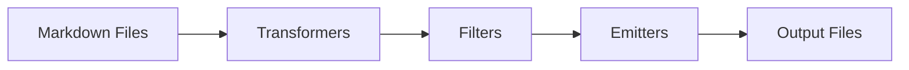

Quartz uses a plugin-based architecture to transform, filter, and emit your content. Plugins are organized into three categories that form a sequential pipeline:

1. **Transformers** - Process and transform Markdown content
2. **Filters** - Decide which content should be published
3. **Emitters** - Generate output files (HTML, assets, indexes, etc.)

## Plugin Pipeline

The build process follows this flow:



<Steps>
  <Step title="Transformers">
    Parse frontmatter, transform Markdown syntax, add syntax highlighting, generate table of contents, and process links.
  </Step>
  <Step title="Filters">
    Determine which files should be published based on frontmatter properties like `draft: true`.
  </Step>
  <Step title="Emitters">
    Generate HTML pages, copy assets, create RSS feeds, sitemaps, and other output files.
  </Step>
</Steps>

## Configuration

Plugins are configured in `quartz.config.ts`:

```typescript title="quartz.config.ts"
import { QuartzConfig } from "./quartz/cfg"
import * as Plugin from "./quartz/plugins"

const config: QuartzConfig = {
  plugins: {
    transformers: [
      Plugin.FrontMatter(),
      Plugin.CreatedModifiedDate({
        priority: ["frontmatter", "git", "filesystem"],
      }),
      Plugin.SyntaxHighlighting({
        theme: {
          light: "github-light",
          dark: "github-dark",
        },
        keepBackground: false,
      }),
      Plugin.ObsidianFlavoredMarkdown({ enableInHtmlEmbed: false }),
      Plugin.GitHubFlavoredMarkdown(),
      Plugin.TableOfContents(),
      Plugin.CrawlLinks({ markdownLinkResolution: "shortest" }),
      Plugin.Description(),
      Plugin.Latex({ renderEngine: "katex" }),
    ],
    filters: [Plugin.RemoveDrafts()],
    emitters: [
      Plugin.AliasRedirects(),
      Plugin.ComponentResources(),
      Plugin.ContentPage(),
      Plugin.FolderPage(),
      Plugin.TagPage(),
      Plugin.ContentIndex({
        enableSiteMap: true,
        enableRSS: true,
      }),
      Plugin.Assets(),
      Plugin.Static(),
      Plugin.NotFoundPage(),
    ],
  },
}

export default config
```

## Plugin Types

### Transformer Plugin Interface

```typescript
export type QuartzTransformerPluginInstance = {
  name: string
  textTransform?: (ctx: BuildCtx, src: string) => string
  markdownPlugins?: (ctx: BuildCtx) => PluggableList
  htmlPlugins?: (ctx: BuildCtx) => PluggableList
  externalResources?: (ctx: BuildCtx) => Partial<StaticResources>
}
```

<ParamField path="name" type="string" required>
  Unique identifier for the plugin
</ParamField>

<ParamField path="textTransform" type="function">
  Transform raw text before Markdown parsing
</ParamField>

<ParamField path="markdownPlugins" type="function">
  Return array of remark plugins to process Markdown AST
</ParamField>

<ParamField path="htmlPlugins" type="function">
  Return array of rehype plugins to process HTML AST
</ParamField>

<ParamField path="externalResources" type="function">
  Inject external CSS/JS resources into pages
</ParamField>

### Filter Plugin Interface

```typescript
export type QuartzFilterPluginInstance = {
  name: string
  shouldPublish(ctx: BuildCtx, content: ProcessedContent): boolean
}
```

<ParamField path="name" type="string" required>
  Unique identifier for the plugin
</ParamField>

<ParamField path="shouldPublish" type="function" required>
  Return `true` to publish the content, `false` to exclude it
</ParamField>

### Emitter Plugin Interface

```typescript
export type QuartzEmitterPluginInstance = {
  name: string
  emit: (
    ctx: BuildCtx,
    content: ProcessedContent[],
    resources: StaticResources,
  ) => Promise<FilePath[]> | AsyncGenerator<FilePath>
  partialEmit?: (...) => Promise<FilePath[]> | AsyncGenerator<FilePath> | null
  getQuartzComponents?: (ctx: BuildCtx) => QuartzComponent[]
  externalResources?: (ctx: BuildCtx) => Partial<StaticResources>
}
```

<ParamField path="name" type="string" required>
  Unique identifier for the plugin
</ParamField>

<ParamField path="emit" type="function" required>
  Generate output files during full build
</ParamField>

<ParamField path="partialEmit" type="function">
  Generate output files during incremental rebuild (dev mode)
</ParamField>

<ParamField path="getQuartzComponents" type="function">
  Return components used for rendering (optimization)
</ParamField>

<ParamField path="externalResources" type="function">
  Inject external CSS/JS resources into pages
</ParamField>

## Plugin Order

<Warning>
  Plugin order matters! Transformers run sequentially in the order specified.
</Warning>

**Best Practices:**

1. **FrontMatter** should always be first (parses metadata)
2. **Markdown syntax plugins** (GFM, OFM) before link processing
3. **CrawlLinks** after syntax plugins (needs final link structure)
4. **Description** near the end (needs processed content)

## Creating Custom Plugins

### Custom Transformer Example

```typescript title="plugins/transformers/myPlugin.ts"
import { QuartzTransformerPlugin } from "../types"

export interface Options {
  customOption: string
}

const defaultOptions: Options = {
  customOption: "default",
}

export const MyCustomPlugin: QuartzTransformerPlugin<Partial<Options>> = (userOpts) => {
  const opts = { ...defaultOptions, ...userOpts }
  
  return {
    name: "MyCustomPlugin",
    markdownPlugins() {
      return [
        () => {
          return (tree, file) => {
            // Transform the Markdown AST
            // tree is a unist Node
            // file is a VFile
          }
        },
      ]
    },
  }
}
```

### Custom Filter Example

```typescript title="plugins/filters/myFilter.ts"
import { QuartzFilterPlugin } from "../types"

export const MyCustomFilter: QuartzFilterPlugin = () => ({
  name: "MyCustomFilter",
  shouldPublish(_ctx, [_tree, vfile]) {
    // Return true to publish, false to exclude
    return vfile.data?.frontmatter?.customFlag !== false
  },
})
```

### Custom Emitter Example

```typescript title="plugins/emitters/myEmitter.ts"
import { QuartzEmitterPlugin } from "../types"
import { write } from "./helpers"

export const MyCustomEmitter: QuartzEmitterPlugin = () => {
  return {
    name: "MyCustomEmitter",
    async *emit(ctx, content, resources) {
      for (const [tree, file] of content) {
        const slug = file.data.slug!
        
        yield write({
          ctx,
          content: "<html>...</html>",
          slug,
          ext: ".html",
        })
      }
    },
  }
}
```

## External Resources

Plugins can inject CSS and JavaScript resources:

```typescript
export const MyPlugin: QuartzTransformerPlugin = () => {
  return {
    name: "MyPlugin",
    externalResources() {
      return {
        css: [
          { content: "https://cdn.example.com/style.css" }
        ],
        js: [
          {
            src: "https://cdn.example.com/script.js",
            loadTime: "afterDOMReady",
            contentType: "external",
          },
        ],
      }
    },
  }
}
```

<CardGroup cols={3}>
  <Card title="Transformers" icon="wand-magic-sparkles" href="./transformers">
    Process and transform Markdown content
  </Card>
  <Card title="Filters" icon="filter" href="./filters">
    Control which content gets published
  </Card>
  <Card title="Emitters" icon="file-export" href="./emitters">
    Generate output files and assets
  </Card>
</CardGroup>

## See Also

- [Unified Documentation](https://unifiedjs.com/) - Plugin system foundation
- [Remark Plugins](https://github.com/remarkjs/remark/blob/main/doc/plugins.md) - Markdown processing
- [Rehype Plugins](https://github.com/rehypejs/rehype/blob/main/doc/plugins.md) - HTML processing